# Yojna Simplifier – Project TODO

> Sequential, atomic task list derived from [PRD](file:///Users/pritampatra/Documents/WEB_DEV_PROJECTS/YojnaSimplifier/YojanaSimplifier_PRD.md), [Design Spec](file:///Users/pritampatra/Documents/WEB_DEV_PROJECTS/YojnaSimplifier/YojnaSimplifier_DESIGN.md), and [Tech Stack](file:///Users/pritampatra/Documents/WEB_DEV_PROJECTS/YojnaSimplifier/YojnaSimplifier_TECHSTACK.md).
> Total estimated time: **~2.5 hours** (MVP build).

---

## Phase 1 — Project Scaffolding & Configuration

### Task 1.1 · Initialize Next.js project (App Router)
- [ ] Run `npx -y create-next-app@latest ./` with App Router, TypeScript, ESLint enabled, **no** Tailwind (vanilla CSS per design spec), `src/` directory optional (prefer flat `app/`).
- [ ] Verify the dev server starts with `npm run dev`.

**Acceptance:** `localhost:3000` renders the default Next.js page.

---

### Task 1.2 · Clean boilerplate & set up folder structure
- [ ] Delete default page content, global CSS reset, and Next.js SVG assets.
- [ ] Create the following folder structure:
  ```
  app/
    layout.tsx          ← root layout (metadata, fonts, global CSS import)
    page.tsx            ← single main page
    globals.css         ← design-system tokens + global styles
    api/
      scheme-info/
        route.ts        ← API route
    components/
      Header.tsx
      SchemeSelector.tsx
      SummarySections.tsx
      SummaryCard.tsx
      CopyButton.tsx
      ErrorBanner.tsx
      LoadingSkeleton.tsx
      EmptyState.tsx
      Footer.tsx
  lib/
    schemes.ts          ← scheme metadata map
    types.ts            ← shared TypeScript types
  ```
- [ ] Ensure `npm run dev` still runs without errors.

**Acceptance:** Empty shell compiles; folder structure matches the above.

---

### Task 1.3 · Configure environment variables
- [ ] Create `.env.local` with:
  ```
  ANAKIN_API_KEY=<placeholder>
  ```
- [ ] Add `.env.local` to `.gitignore` (should already be there via create-next-app).
- [ ] Verify the key is accessible in API route via `process.env.ANAKIN_API_KEY`.

**Acceptance:** `console.log` in API route prints the key during dev; key is **not** accessible in client components.

---

### Task 1.4 · Initialize Git repository
- [ ] Run `git init`, create `.gitignore` (ensure `node_modules`, `.env.local`, `.next` are ignored).
- [ ] Make initial commit: `chore: project scaffold`.

**Acceptance:** Clean git history with one commit.

---

## Phase 2 — Design System & Global Styles

### Task 2.1 · Define CSS custom properties (design tokens)
- [ ] In `globals.css`, define:
  - **Colors:** `--color-primary` (soft blue), `--color-accent` (warm yellow/orange), `--color-bg` (light grey/off-white), `--color-card` (white), `--color-text` (dark grey), `--color-text-light`, `--color-error` (light red), `--color-error-border` (amber/red).
  - **Typography:** `--font-family` (`Inter, system-ui, -apple-system, BlinkMacSystemFont, "Segoe UI", sans-serif`), `--font-size-h1` (24–28px), `--font-size-h2` (18–20px), `--font-size-body` (14–16px), `--font-size-label` (12–14px), `--line-height` (~1.5).
  - **Spacing:** `--space-xs` (4px), `--space-sm` (8px), `--space-md` (16px), `--space-lg` (24px), `--space-xl` (32px).
  - **Radii:** `--radius-card` (8px), `--radius-btn` (6px), `--radius-pill` (999px).
  - **Shadows:** `--shadow-card` (subtle).
  - **Sizes:** `--max-width` (960px), `--min-tap-target` (44px).

**Acceptance:** All tokens defined in `:root`; no hard-coded values elsewhere in the project.

---

### Task 2.2 · Add global reset & base typography styles
- [ ] Add a minimal CSS reset (box-sizing, margin, padding reset).
- [ ] Set `body` styles: font-family, font-size, color, background-color using tokens.
- [ ] Import Google Font **Inter** (400, 500, 600, 700) in `layout.tsx` via `next/font/google` or `<link>`.
- [ ] Set heading styles (`h1`, `h2`) using design-spec sizes.

**Acceptance:** Any text rendered on page uses Inter with correct sizing and colour.

---

### Task 2.3 · Define reusable utility classes
- [ ] Add utility classes in `globals.css` for:
  - `.container` — centered, `max-width: var(--max-width)`, horizontal padding.
  - `.card` — white bg, rounded corners, shadow/border, padding.
  - `.btn-primary` — filled blue, white text, rounded, min-height 44px, hover darkens.
  - `.btn-secondary` — outlined blue, white bg, primary text, hover fill.
  - `.btn-disabled` — grey, no hover.
  - `.badge` — pill shape, light primary bg, small text.
  - `.sr-only` — screen-reader only text for accessibility.

**Acceptance:** Applying `.card` to a `<div>` renders a properly styled card matching the design spec.

---

### Task 2.4 · Commit design system
- [ ] Commit: `style: design system tokens, reset, and utility classes`.

---

## Phase 3 — Data Layer & Scheme Config

### Task 3.1 · Define TypeScript types
- [ ] In `lib/types.ts`, define:
  ```ts
  export interface SchemeMetadata {
    id: string;
    name: string;           // human-friendly name
    department: string;      // ministry/department label
    category: string;        // e.g. "Agriculture", "Pension", "Education"
    state: string;           // "Karnataka"
    officialUrl: string;     // URL for scraping
  }

  export interface SchemeSummary {
    overview: string[];      // bullet points
    eligibility: string[];   // bullet points
    documents: string[];     // bullet points
    steps: string[];         // numbered steps
  }

  export interface SchemeInfoResponse {
    success: boolean;
    data?: SchemeSummary;
    error?: string;
    officialUrl?: string;
  }
  ```

**Acceptance:** Types compile; imported in both API route and components without error.

---

### Task 3.2 · Create scheme metadata map
- [ ] In `lib/schemes.ts`, create and export:
  ```ts
  export const SCHEMES: SchemeMetadata[] = [ ... ];
  ```
  Populate with **2–3 real Karnataka schemes**, e.g.:
  1. **PM-Kisan (Karnataka flow)** — Agriculture, URL from myScheme/Seva Sindhu.
  2. **Vidyasiri Scholarship** — Education/Student.
  3. **Sandhya Suraksha Yojana** — Pension/Welfare.
- [ ] Add a helper: `export function getSchemeById(id: string): SchemeMetadata | undefined`.

**Acceptance:** `getSchemeById("pm-kisan-ka")` returns the correct object.

---

### Task 3.3 · Commit data layer
- [ ] Commit: `feat: scheme types and metadata config`.

---

## Phase 4 — Backend API Route

### Task 4.1 · Create `/api/scheme-info` route skeleton
- [ ] In `app/api/scheme-info/route.ts`, create a `POST` handler that:
  1. Reads `schemeId` from request body JSON.
  2. Validates `schemeId` is non-empty.
  3. Looks up scheme via `getSchemeById(schemeId)`.
  4. Returns `400` if scheme not found.
  5. Returns a **stubbed** `SchemeInfoResponse` with placeholder data for now.

**Acceptance:** `curl -X POST http://localhost:3000/api/scheme-info -d '{"schemeId":"pm-kisan-ka"}'` returns a 200 JSON response with placeholder summary.

---

### Task 4.2 · Integrate Anakin URL Scraper API call
- [ ] Replace the stub with a real `fetch` call to Anakin's endpoint:
  ```
  POST https://api.anakin.ai/v1/url-scraper
  Headers: { "Authorization": "Bearer <ANAKIN_API_KEY>", "Content-Type": "application/json" }
  Body: { "url": "<officialUrl>", "formats": ["markdown"] }
  ```
  *(Adjust endpoint/headers per Anakin's actual 2026 docs.)*
- [ ] Read the Anakin response and extract raw markdown/text.
- [ ] Use Node.js runtime (`export const runtime = 'nodejs'`).

**Acceptance:** API route successfully calls Anakin and returns raw scraped content (even if unparsed).

---

### Task 4.3 · Parse & normalize scraped content into structured summary
- [ ] Write a `parseSummary(rawMarkdown: string): SchemeSummary` function in `lib/parse-summary.ts`.
- [ ] Use simple heuristics / regex to split the markdown into:
  - `overview` — first section or intro paragraphs → bullet points.
  - `eligibility` — section matching "eligib" keyword → bullet points.
  - `documents` — section matching "document" keyword → bullet points.
  - `steps` — section matching "how to apply" / "steps" → numbered list.
- [ ] If a section can't be found, return `["Information not clearly available on official page."]` as the fallback.

**Acceptance:** Given sample markdown from a scheme page, function returns a well-structured `SchemeSummary` with at least 2 of 3 sections meaningfully filled.

---

### Task 4.4 · Add error handling to API route
- [ ] Wrap Anakin call in try/catch.
- [ ] Handle specific cases:
  - Missing/invalid `ANAKIN_API_KEY` → 500 with message.
  - Anakin returns non-200 (rate limit, bad request) → map to user-friendly error.
  - Fetch timeout (set `AbortController` with 10s timeout) → timeout error message.
  - Parsing produces empty results → partial success with fallback text.
- [ ] Always return `SchemeInfoResponse` shape; **never** leak raw errors or stack traces.

**Acceptance:** Simulating a bad API key or network failure returns a clean JSON error, not a 500 with stack trace.

---

### Task 4.5 · Commit backend
- [ ] Commit: `feat: API route with Anakin integration and error handling`.

---

## Phase 5 — Frontend Components (Static Shell)

### Task 5.1 · Build `<Header />` component
- [ ] White background, horizontally padded `.container`.
- [ ] Left: Wordmark **"Yojana Simplifier"** in primary color, semi-bold.
- [ ] Right: `<span class="badge">Beta</span>` + small disclaimer text "Not an official govt website".
- [ ] Sticky/fixed at top on mobile; subtle bottom border.

**Acceptance:** Header renders correctly on 360px and 1280px viewports.

---

### Task 5.2 · Build `<EmptyState />` component
- [ ] Centered layout with a simple icon (📋 emoji or inline SVG).
- [ ] Text: *"Select a scheme to see a simple summary of who is eligible and how to apply."*
- [ ] Light grey text, generous padding.

**Acceptance:** Component renders when no scheme is selected.

---

### Task 5.3 · Build `<LoadingSkeleton />` component
- [ ] Three skeleton cards (matching `SummaryCard` dimensions).
- [ ] Each card has 3 animated grey placeholder lines (pulse animation via CSS `@keyframes`).
- [ ] Text below cards: *"Fetching details from official portal…"*

**Acceptance:** Skeleton cards animate smoothly; visually match the size of real summary cards.

---

### Task 5.4 · Build `<ErrorBanner />` component
- [ ] Props: `message: string`, `officialUrl: string`, `onRetry: () => void`.
- [ ] Styled as a light-red/amber bordered box (per design spec §6.2).
- [ ] Title: *"Could not fetch scheme details right now."*
- [ ] Body: dynamic `message` text.
- [ ] Two actions:
  - "Try again" → calls `onRetry` (primary button).
  - "Open official site" → `<a>` opening `officialUrl` in new tab (link-style).

**Acceptance:** Renders with both buttons functional; looks clean on mobile.

---

### Task 5.5 · Build `<SummaryCard />` component
- [ ] Props: `title: string`, `items: string[]`, `type: 'bullets' | 'numbered'`.
- [ ] Renders a `.card` with:
  - Title row: H2 left, `<span class="badge">From official site</span>` right.
  - Body: `<ul>` for bullets or `<ol>` for numbered steps.
- [ ] If items contain the fallback text, render it in a muted style.

**Acceptance:** Card renders bullet list and numbered list correctly; matches design spec §5.4.

---

### Task 5.6 · Build `<Footer />` component
- [ ] Small disclaimer: *"Information shown here is summarised from official government websites. Always verify details on the official portal before applying."*
- [ ] Centered, small text, top border, generous padding.

**Acceptance:** Footer is visible at bottom of page content (not fixed).

---

### Task 5.7 · Assemble static page layout in `page.tsx`
- [ ] Compose the page:
  ```
  <Header />
  <main class="container">
    <HeroSection />       ← inline: title + subtitle text
    <SchemeSelector />    ← placeholder for now (empty div)
    <EmptyState />        ← shown by default
    <!-- SummarySections, ErrorBanner, LoadingSkeleton hidden initially -->
  </main>
  <Footer />
  ```
- [ ] Add SEO metadata in `layout.tsx`:
  - Title: "Yojana Simplifier – Understand Karnataka Govt Schemes in Simple Language"
  - Meta description, viewport, `lang="en"`.
- [ ] Verify responsive layout: single column on mobile, centered max-width on desktop.

**Acceptance:** Page renders the full static shell with Header, Hero text, Empty State, and Footer. Looks polished on both 360px and 1280px.

---

### Task 5.8 · Commit static shell
- [ ] Commit: `feat: static page shell with all presentational components`.

---

## Phase 6 — Frontend Components (Interactive Logic)

### Task 6.1 · Build `<SchemeSelector />` client component
- [ ] Mark as `"use client"`.
- [ ] Render a styled `<select>` dropdown populated from `SCHEMES` array (imported from `lib/schemes.ts`).
  - Default option: *"— Select a scheme —"* (disabled, selected).
  - Each option shows `scheme.name` + `scheme.department` in parentheses.
- [ ] Render a **"Get Details"** primary button (disabled until a scheme is selected).
- [ ] Small helper text below: *"Data fetched from official Karnataka portals."*
- [ ] Expose `onSchemeSelect(schemeId: string)` via props or internal state.
- [ ] Add category/state badges next to the selector (e.g., "State: Karnataka").

**Acceptance:** Dropdown lists all schemes; button enables only after selection; looks correct on 360px.

---

### Task 6.2 · Wire up page state management
- [ ] Convert `page.tsx` into a client component (or create a `<MainContent />` client wrapper).
- [ ] Manage state:
  ```ts
  type PageState = 'idle' | 'loading' | 'success' | 'error';
  const [pageState, setPageState] = useState<PageState>('idle');
  const [selectedSchemeId, setSelectedSchemeId] = useState<string | null>(null);
  const [summaryData, setSummaryData] = useState<SchemeSummary | null>(null);
  const [errorInfo, setErrorInfo] = useState<{ message: string; officialUrl: string } | null>(null);
  ```
- [ ] Conditionally render:
  - `idle` → `<EmptyState />`
  - `loading` → `<LoadingSkeleton />`
  - `success` → `<SummarySections />` (three `<SummaryCard />` instances)
  - `error` → `<ErrorBanner />`

**Acceptance:** Manually setting state in code switches between all four UI states correctly.

---

### Task 6.3 · Implement fetch logic on "Get Details" click
- [ ] On button click:
  1. Set state to `loading`.
  2. `fetch('/api/scheme-info', { method: 'POST', body: JSON.stringify({ schemeId }) })`.
  3. On success → set `summaryData`, state to `success`.
  4. On error → set `errorInfo`, state to `error`.
- [ ] On "Try again" in `<ErrorBanner />`:
  1. Re-trigger the same fetch with the same `schemeId`.

**Acceptance:** Selecting a scheme and clicking "Get Details" shows loading skeleton, then summary cards (or error banner). Time to display < 5 seconds on normal connection.

---

### Task 6.4 · Build `<SummarySections />` wrapper component
- [ ] Props: `data: SchemeSummary`.
- [ ] Renders three `<SummaryCard />` components:
  1. Title: "Overview", items: `data.overview`, type: `bullets`.
  2. Title: "Eligibility", items: `data.eligibility`, type: `bullets`.
  3. Title: "Documents & Steps to Apply", items: `data.documents` (bullets) **+** `data.steps` (numbered).
     - *Sub-task:* Either render two sub-sections within one card, or split into two cards — choose based on visual balance.

**Acceptance:** All three/four sections render with correct formatting and badges.

---

### Task 6.5 · Commit interactive logic
- [ ] Commit: `feat: scheme selection, API fetch, and dynamic rendering`.

---

## Phase 7 — Copy/Share & UX Polish

### Task 7.1 · Build `<CopyButton />` component
- [ ] Props: `summaryData: SchemeSummary`, `schemeName: string`.
- [ ] On click:
  1. Format summary as plain text with headings and bullets:
     ```
     📋 Yojana Simplifier – <schemeName>

     ✅ Overview
     • item 1
     • item 2

     👤 Eligibility
     • item 1

     📄 Documents Needed
     • item 1

     📝 Steps to Apply
     1. step 1
     2. step 2

     ⚠️ Always verify on the official portal before applying.
     ```
  2. Copy to clipboard via `navigator.clipboard.writeText()`.
  3. Show a toast/snackbar: *"Summary copied – paste into WhatsApp or notes."*
- [ ] Use secondary button style; add a small copy icon (📋 emoji or SVG).

**Acceptance:** After clicking, pasting into a text editor shows the formatted summary. Toast appears and auto-dismisses after 3 seconds.

---

### Task 7.2 · Build toast notification system
- [ ] Create a lightweight `<Toast />` component (no library needed).
- [ ] Fixed position bottom-center, slides up, auto-dismisses after 3s.
- [ ] Subtle background (dark grey or primary), white text, rounded.
- [ ] Manage via state in the page wrapper or a simple context.

**Acceptance:** Toast appears on copy, is readable, and disappears smoothly.

---

### Task 7.3 · Add micro-animations & transitions
- [ ] Add CSS transitions for:
  - Summary cards: fade-in + slight slide-up on appear (`opacity` + `transform`).
  - Buttons: hover scale/shadow transition.
  - State transitions (idle → loading → success): smooth crossfade.
- [ ] Keep animations subtle and fast (200–300ms); respect `prefers-reduced-motion`.

**Acceptance:** UI feels polished but not distracting; animations are smooth on low-end devices.

---

### Task 7.4 · Mobile responsiveness pass
- [ ] Test and fix layout at viewports: **360px**, **390px**, **768px**, **1280px**.
- [ ] Verify:
  - No horizontal scrolling at any breakpoint.
  - All tap targets ≥ 44px.
  - Font sizes are readable (body ≥ 14px).
  - Cards stack vertically on mobile.
  - Header doesn't overflow.
  - "Get Details" and "Copy" buttons are visible without excessive scrolling.

**Acceptance:** All viewports pass visual inspection per design spec §8.

---

### Task 7.5 · Accessibility pass
- [ ] Add proper `aria-label` attributes to interactive elements.
- [ ] Ensure colour contrast ratios meet WCAG AA (4.5:1 for text).
- [ ] Add `aria-live="polite"` to the summary/error area so screen readers announce changes.
- [ ] Ensure keyboard navigation works: Tab through selector → button → copy → retry.
- [ ] Use semantic HTML: `<header>`, `<main>`, `<footer>`, `<section>`, `<nav>`.

**Acceptance:** Basic keyboard-only navigation works end-to-end; no contrast warnings.

---

### Task 7.6 · Commit UX polish
- [ ] Commit: `style: copy/share, animations, responsive, and accessibility polish`.

---

## Phase 8 — Testing, Deployment & Final Checks

### Task 8.1 · Manual end-to-end test (happy path)
- [ ] Select each of the 2–3 schemes → click "Get Details" → verify summary renders.
- [ ] Verify at least 2 of 3 sections are meaningfully filled per scheme.
- [ ] Copy summary → paste into Notes/WhatsApp → verify formatting.
- [ ] Test on mobile viewport (360px) using browser DevTools.

**Acceptance:** All schemes return usable summaries; copy works; mobile layout is correct.

---

### Task 8.2 · Manual end-to-end test (error paths)
- [ ] Simulate bad API key → verify error banner appears with "Try again" and "Open official site".
- [ ] Simulate network timeout (disconnect network) → verify graceful error.
- [ ] Simulate selecting invalid scheme (if possible) → verify 400 error is handled.
- [ ] Verify no raw JSON or stack traces appear in the UI under any error condition.

**Acceptance:** All error states show user-friendly messages per PRD §5.5.

---

### Task 8.3 · Performance check
- [ ] Run Lighthouse on `localhost:3000` (mobile preset).
- [ ] Target: Performance ≥ 90, Accessibility ≥ 90.
- [ ] Verify "Get Details" → summary appears in < 5 seconds.
- [ ] Check bundle size is reasonable (no unnecessary large dependencies).

**Acceptance:** Lighthouse scores meet targets; page loads fast on simulated slow 3G.

---

### Task 8.4 · Prepare for Vercel deployment
- [ ] Ensure `next.config.js` has no local-only settings.
- [ ] Verify `package.json` scripts: `dev`, `build`, `start` all work.
- [ ] Run `npm run build` locally → fix any build errors.
- [ ] Create a `README.md` with:
  - Project description.
  - Setup instructions (`npm install`, `.env.local` setup, `npm run dev`).
  - Tech stack summary.

**Acceptance:** `npm run build` passes with zero errors or warnings.

---

### Task 8.5 · Deploy to Vercel
- [ ] Push to GitHub repository.
- [ ] Connect repo to Vercel.
- [ ] Add `ANAKIN_API_KEY` environment variable in Vercel dashboard.
- [ ] Deploy and verify production URL works.
- [ ] Test one scheme end-to-end on the live URL.

**Acceptance:** Live URL renders correctly; API calls work; no CORS or env-var issues.

---

### Task 8.6 · Final commit & tag
- [ ] Final commit: `chore: production-ready MVP`.
- [ ] Tag: `v0.1.0-mvp`.

**Acceptance:** Clean git history; tagged release.

---

## Task Dependency Graph

```mermaid
graph TD
    A[1.1 Init Next.js] --> B[1.2 Clean & Folder Structure]
    B --> C[1.3 Env Variables]
    C --> D[1.4 Git Init]
    D --> E[2.1 CSS Tokens]
    E --> F[2.2 Reset & Typography]
    F --> G[2.3 Utility Classes]
    G --> H[2.4 Commit Design System]
    H --> I[3.1 TypeScript Types]
    I --> J[3.2 Scheme Metadata]
    J --> K[3.3 Commit Data Layer]
    K --> L[4.1 API Skeleton]
    L --> M[4.2 Anakin Integration]
    M --> N[4.3 Parse & Normalize]
    N --> O[4.4 Error Handling]
    O --> P[4.5 Commit Backend]
    P --> Q[5.1 Header]
    Q --> R[5.2 EmptyState]
    R --> S[5.3 LoadingSkeleton]
    S --> T[5.4 ErrorBanner]
    T --> U[5.5 SummaryCard]
    U --> V[5.6 Footer]
    V --> W[5.7 Assemble Page]
    W --> X[5.8 Commit Static Shell]
    X --> Y[6.1 SchemeSelector]
    Y --> Z[6.2 State Management]
    Z --> AA[6.3 Fetch Logic]
    AA --> AB[6.4 SummarySections]
    AB --> AC[6.5 Commit Interactive]
    AC --> AD[7.1 CopyButton]
    AD --> AE[7.2 Toast System]
    AE --> AF[7.3 Animations]
    AF --> AG[7.4 Mobile Responsive]
    AG --> AH[7.5 Accessibility]
    AH --> AI[7.6 Commit Polish]
    AI --> AJ[8.1 Happy Path Test]
    AJ --> AK[8.2 Error Path Test]
    AK --> AL[8.3 Performance Check]
    AL --> AM[8.4 Prepare Deploy]
    AM --> AN[8.5 Deploy Vercel]
    AN --> AO[8.6 Final Tag]
```



---

> [!TIP]
> Work through tasks **strictly in order**. Each task builds on the previous one. Check off items as you complete them. If a task reveals a new sub-task, insert it immediately after the current task before moving on.
